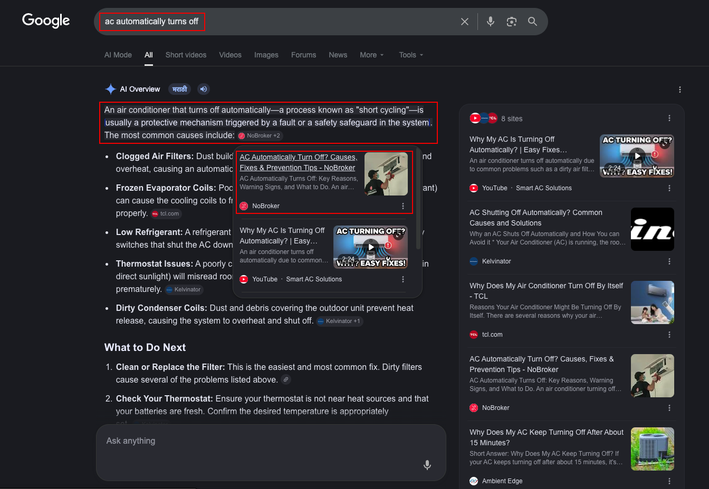

# Quick Reference - SEO Results Customization Guide

## 🚀 Most Common Customizations

### 1. Update Metric Numbers (Easiest)

**File**: `seo-results.html`

**Find the metric cards section** and update these values:

```html
<!-- Keywords Ranked -->
<div class="metric-card" data-target="1250">
  <div class="metric-number">0</div>
  <h3>Keywords Ranked</h3>
</div>

<!-- Change 1250 to your number -->
<!-- Change to: <div class="metric-card" data-target="YOUR_NUMBER"> -->
```

**All 6 Metrics to Update** (search for `data-target=`):

1. Keywords Ranked: Line ~380
2. Organic Traffic: Line ~406
3. Total Impressions: Line ~432
4. Articles on Page #1: Line ~458
5. Featured Snippets: Line ~484
6. CTR Improvement: Line ~512 (use `data-suffix="%"`)

---

### 2. Update Chart Data

**File**: `seo-results.js`

**Find**: Search for `initializeCharts()` function around line 100

#### Update Organic Traffic Chart:

```javascript
// Find this line in trafficChart dataset
data: [
  1200, 1800, 2500, 3200, 4100, 5200, 6800, 8500, 10200, 13500, 16800, 21400
  // ^Replace with your monthly data (12 values for 12 months)
],
```

#### Update Keywords Chart:

```javascript
// Find keywords ranking positions data
datasets: [
  {
    data: [156, 278, 412, 698, 1250],
    // Update these 5 numbers for your ranking distribution
  },
];
```

#### Update Impressions vs Clicks:

```javascript
// Two datasets to update:
data: [25000, 28000, 32000, 35000, 38000, 40000, 42000, 45000],
// ^Impressions

data: [1200, 1450, 1680, 1850, 2100, 2350, 2580, 2800],
// ^Clicks
```

#### Update Monthly Comparison:

```javascript
// 2023 data (first dataset)
data: [2000, 2200, 2400, 2600, 2800, 3000, 3200, 3400, 3600, 3800, 4000, 4200],

// 2024 data (second dataset)
data: [8500, 9200, 10200, 11500, 13000, 14500, 16000, 17500, 19000, 20500, 22000, 23500],
```

---

### 3. Update Ranking Showcase Cards

**File**: `seo-results.html`

**Find**: "Google Ranking Showcase Section" around line ~650

**Update Single Card**:

```html
<!-- Change the rank number -->
<span class="text-2xl font-bold text-purple-600">#1</span>
<!-- Change to: <span class="text-2xl font-bold text-purple-600">#YOUR_RANK</span> -->

<!-- Change the keyword -->
<h3 class="text-2xl font-bold text-gray-900 mb-3">Content Writing Services</h3>
<!-- Change to your keyword -->

<!-- Change the metrics -->
<span class="font-bold text-purple-600">2,400+ visits</span>
<!-- Update traffic number -->

<span class="font-bold text-pink-600">45,000+</span>
<!-- Update impressions -->

<span class="font-bold text-blue-600">5.3%</span>
<!-- Update CTR -->

<!-- Update the button image -->
<button onclick="openGalleryModal('1.png')">
  <!-- Change '1.png' to your image filename -->
</button>
```

---

### 4. Update Case Studies

**File**: `seo-results.html`

**Find**: "SEO Case Studies Section" around line ~900

**Update Case Study Header**:

```html
<h3 class="text-2xl md:text-3xl font-bold text-gray-900 mb-2">
  📝 Technical Content Writing - 3 Month Campaign
</h3>
<!-- Change the title and emoji -->

<!-- Update badges -->
<span
  class="inline-block px-3 py-1 bg-purple-100 text-purple-700 rounded-full text-sm mr-3 mb-2"
>
  12 Articles Published
</span>
<!-- Update these values with your stats -->
```

**Update Case Study Content** (inside case-study-body):

```html
<!-- Strategy points -->
<li>✓ Deep keyword research targeting long-tail terms</li>
<!-- Update these bullet points -->

<!-- Results -->
<li>✓ Average ranking position: #8</li>
<!-- Update with your results -->

<!-- Topics -->
<span
  class="px-4 py-2 bg-purple-100 text-purple-700 rounded-full text-sm font-medium"
>
  API Integration
</span>
<!-- Update topic tags -->

<!-- Before/After -->
<p class="text-2xl font-bold text-gray-400">2 articles</p>
<p class="text-2xl font-bold text-purple-600">12 articles</p>
<!-- Update before/after metrics -->
```

---

### 5. Update Gallery Images

**File**: `seo-results.html`

**Find**: "Visual Proof Gallery Section" around line ~1100

```html
<!-- Single gallery item -->
<div onclick="openGalleryModal('1.png')">
  <!-- Change '1.png' to your image -->
  
  <!-- Update both -->
  <h3 class="font-bold text-gray-900">SERP Position #1</h3>
  <p class="text-sm text-gray-600">Google ranking proof</p>
  <!-- Update title and description -->
</div>
```

**Steps**:

1. Place your image files in the project root (same folder as index.html)
2. Update the filename in `onclick="openGalleryModal('[FILENAME].png')"`
3. Update the ``
4. Update the title and description text

---

### 6. Update Timeline Milestones

**File**: `seo-results.html`

**Find**: "Timeline / Growth Journey Section" around line ~1200

```html
<div class="timeline-item">
  <div class="timeline-dot"></div>
  <div class="timeline-content">
    <div class="bg-white/70 ...">
      <!-- Change the badge -->
      <span class="... bg-purple-100 text-purple-700 ...">
        Month 1
        <!-- Change to your month/timeframe -->
      </span>

      <!-- Change title -->
      <h3 class="text-xl font-bold text-gray-900 mb-2">
        First Keyword Ranked 🚀
      </h3>

      <!-- Change description -->
      <p class="text-gray-600">Published first SEO-optimized article...</p>
    </div>
  </div>
</div>
```

---

## 🎨 Color Changes

### To Change Card Gradient Colors

**File**: `seo-results.html`

Find the gradient div in any card/section:

```html
<div class="h-40 bg-gradient-to-br from-purple-500 to-pink-500 ..."></div>
```

**Replace color names** with Tailwind colors:

- Purple: `purple-500`, `purple-600`
- Pink: `pink-500`, `pink-600`
- Blue: `blue-500`, `blue-600`
- Green: `green-500`, `green-600`
- Red: `red-500`, `red-600`
- Orange: `orange-500`, `orange-600`
- Yellow: `yellow-500`, `yellow-600`

---

### To Change Chart Colors

**File**: `seo-results.js`

```javascript
const gradientColor = {
  purple: "#8b5cf6", // Change this hex code
  pink: "#ec4899", // Change this hex code
  blue: "#3b82f6",
  cyan: "#06b6d4",
  green: "#10b981",
  orange: "#f97316",
};
```

Then use in charts:

```javascript
borderColor: gradientColor.purple,  // Uses the color from above
```

---

## 🔧 Advanced Customizations

### Add New Metric Card

**File**: `seo-results.html`

**Copy this template** and paste in the metrics grid:

```html
<div
  class="group bg-white/70 backdrop-blur-xl rounded-3xl p-8 border border-white/20 hover:shadow-2xl transition-all duration-500 hover:-translate-y-3 text-center metric-card"
  data-target="NUMBER_HERE"
  data-suffix=""
>
  <div
    class="w-16 h-16 bg-gradient-to-br from-COLOR-500 to-COLOR-600 rounded-2xl flex items-center justify-center mx-auto mb-6 group-hover:scale-110 group-hover:rotate-6 transition-transform duration-300"
  >
    <svg
      class="w-8 h-8 text-white"
      fill="none"
      stroke="currentColor"
      viewBox="0 0 24 24"
    >
      <path
        stroke-linecap="round"
        stroke-linejoin="round"
        stroke-width="2"
        d="YOUR_SVG_PATH"
      ></path>
    </svg>
  </div>
  <div class="metric-number text-6xl font-bold text-COLOR-600 mb-2">0</div>
  <h3 class="text-xl font-bold text-gray-900 mb-2">TITLE</h3>
  <p class="text-gray-600">DESCRIPTION</p>
</div>
```

**Replace**:

- `NUMBER_HERE`: Your metric value
- `COLOR`: Your chosen color (e.g., `blue`, `green`, `red`)
- `SVG_PATH`: Icon path from any SVG icon
- `TITLE`: Card title
- `DESCRIPTION`: Card description

---

### Add New Ranking Card

**File**: `seo-results.html`

**Copy template** and add to ranking showcase:

```html
<div
  class="group bg-white/70 backdrop-blur-xl rounded-3xl overflow-hidden border border-white/20 hover:shadow-2xl transition-all duration-300 hover:-translate-y-2"
>
  <div
    class="h-40 bg-gradient-to-br from-COLOR-500 to-COLOR-500 relative overflow-hidden"
  >
    <div class="absolute top-4 right-4 bg-white/90 px-4 py-2 rounded-full">
      <span class="text-2xl font-bold text-COLOR-600">#RANK</span>
    </div>
  </div>
  <div class="p-6">
    <h3 class="text-2xl font-bold text-gray-900 mb-3">KEYWORD</h3>
    <div class="space-y-3 mb-6">
      <div class="flex items-center justify-between">
        <span class="text-gray-600">Monthly Traffic:</span>
        <span class="font-bold text-COLOR-600">TRAFFIC</span>
      </div>
      <div class="flex items-center justify-between">
        <span class="text-gray-600">Impressions:</span>
        <span class="font-bold text-COLOR-600">IMPRESSIONS</span>
      </div>
      <div class="flex items-center justify-between">
        <span class="text-gray-600">CTR:</span>
        <span class="font-bold text-blue-600">CTR%</span>
      </div>
    </div>
    <p class="text-gray-600 text-sm mb-6">DESCRIPTION</p>
    <button
      onclick="openGalleryModal('IMAGE.png')"
      class="w-full bg-gradient-to-r from-COLOR-600 to-COLOR-600 text-white py-3 rounded-xl font-medium hover:shadow-lg transition-all duration-300 hover:-translate-y-1"
    >
      View SERP Screenshot
    </button>
  </div>
</div>
```

---

## ⚡ Performance Tips

1. **Optimize Images**: Compress SERP screenshots before adding (use TinyPNG)
2. **Limit Charts**: Keep charts to 4 max (performance)
3. **Lazy Load**: Images are auto-lazy-loaded if using `data-src`
4. **Clear Cache**: Clear browser cache after changes to see updates

---

## 🐛 Troubleshooting

| Issue                    | Solution                                                    |
| ------------------------ | ----------------------------------------------------------- |
| Numbers not counting up  | Clear browser cache, refresh page                           |
| Charts not showing       | Check browser console for errors, verify Chart.js CDN loads |
| Images not loading       | Verify image filename matches exactly (case-sensitive)      |
| Modal not opening        | Check image path in `openGalleryModal()`                    |
| Case study not expanding | Check `toggleCaseStudy()` function is called                |
| Mobile menu not working  | Ensure `seo-results.js` is loaded correctly                 |

---

## 📝 File Locations Reference

| What to Change  | File                               | Line Range | How Often |
| --------------- | ---------------------------------- | ---------- | --------- |
| Metric numbers  | seo-results.html                   | 380-512    | Monthly   |
| Chart data      | seo-results.js                     | 80-200     | Monthly   |
| Ranking cards   | seo-results.html                   | 650-750    | Quarterly |
| Case studies    | seo-results.html                   | 900-1050   | As needed |
| Gallery images  | seo-results.html                   | 1100-1180  | As needed |
| Timeline events | seo-results.html                   | 1200-1300  | Quarterly |
| Colors/styling  | seo-results.html or seo-results.js | Throughout | Rarely    |

---

## ✅ Validation Checklist

Before publishing updates:

- [ ] All metric numbers are realistic/accurate
- [ ] Chart data is in chronological order
- [ ] All images exist and are in correct folder
- [ ] All image filenames match exactly (case-sensitive)
- [ ] Tested on desktop (Chrome, Firefox, Safari)
- [ ] Tested on mobile (iOS Safari, Chrome Mobile)
- [ ] All buttons/links work
- [ ] Charts load without errors
- [ ] Count-up animations work
- [ ] Modal opens/closes properly

---

**Last Updated**: 2024
**Quick Reference Version**: 1.0
