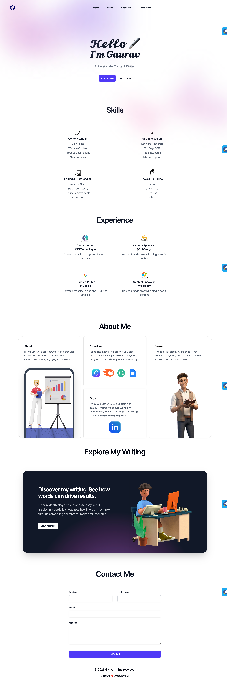

# 🌐 Gaurav Koli - Personal Portfolio Website

A sleek and modern portfolio website built with **Tailwind CSS**, showcasing my experience, writing skills, and services as a **Content Writer**. It’s designed to reflect professionalism, creativity, and clarity — helping brands discover what I can do for them.

## 🚀 Live Demo

👉 [Visit My Portfolio](https://gk091202.github.io/Portfolio_Tailwind/index.html)

---

## 📸 Preview

---

## 📁 Features

- 💼 **About Me** – Short introduction and personal branding  
- ✍️ **Skills** – Categorized skillset including SEO, writing, tools & more  
- 🧑‍💼 **Experience** – Work history with companies like Google, Microsoft, K2Technologies  
- 📖 **Explore My Writing** – CTA section showcasing writing samples  
- 📬 **Contact Me** – Simple and responsive contact form  
- 📱 **Responsive Design** – Fully optimized for desktop and mobile  
- 🎨 **Modern UI** – Built with Tailwind CSS for fast and clean design  

---

## 🛠 Tech Stack

- ⚙️ **HTML5**  
- 🎨 **Tailwind CSS**  
- 💻 **VS Code**  
- 🧠 **Git & GitHub**

---

## 📌 How to Use

1. **Clone the repository** -
**bash** -
git clone https://github.com/Gk091202/Portfolio_Tailwind.git

2. **bash** - 

cd Portfolio_Tailwind 

3. **Open in browser** - 
Just double-click index.html or open it via your browser. 

4. **Customize the content** -
Update text, images, and links to make it your own. 

5. **Deploy (Optional)** -
Deploy your  site using GitHub Pages, Netlify, or Vercel. 

---

MIT License

Copyright (c) 2025 Gaurav Koli

Permission is hereby granted, free of charge, to any person obtaining a copy
of this software and associated documentation files (the "Software"), to deal
in the Software without restriction, including without limitation the rights  
to use, copy, modify, merge, publish, distribute, sublicense, and/or sell      
copies of the Software, and to permit persons to whom the Software is         
furnished to do so, subject to the following conditions:                       

The above copyright notice and this permission notice shall be included in all
copies or substantial portions of the Software.                                

THE SOFTWARE IS PROVIDED "AS IS", WITHOUT WARRANTY OF ANY KIND, EXPRESS OR    
IMPLIED, INCLUDING BUT NOT LIMITED TO THE WARRANTIES OF MERCHANTABILITY,      
FITNESS FOR A PARTICULAR PURPOSE AND NONINFRINGEMENT. IN NO EVENT SHALL THE   
AUTHORS OR COPYRIGHT HOLDERS BE LIABLE FOR ANY CLAIM, DAMAGES OR OTHER        
LIABILITY, WHETHER IN AN ACTION OF CONTRACT, TORT OR OTHERWISE, ARISING FROM, 
OUT OF OR IN CONNECTION WITH THE SOFTWARE OR THE USE OR OTHER DEALINGS IN THE 
SOFTWARE.
---
